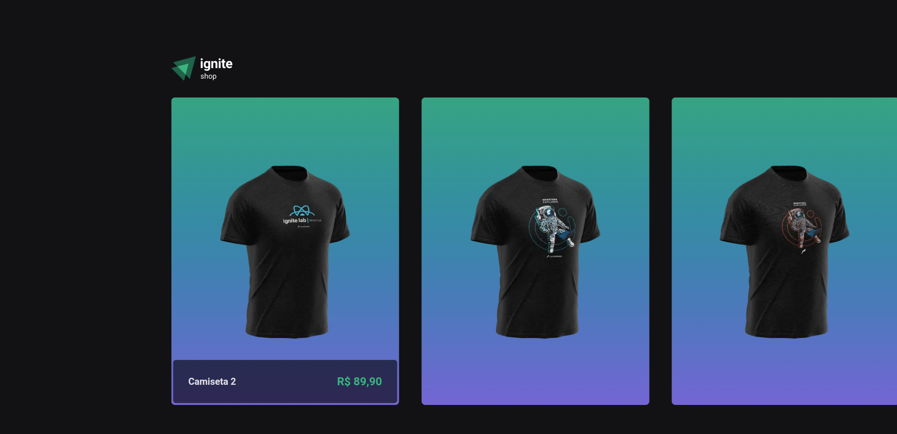
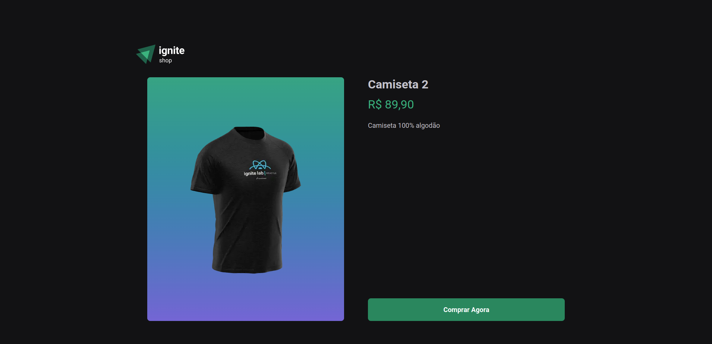
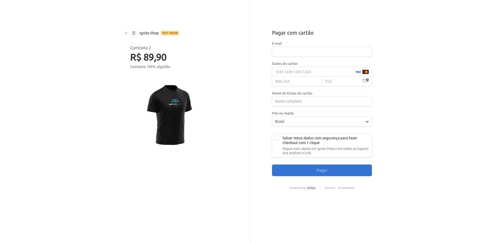
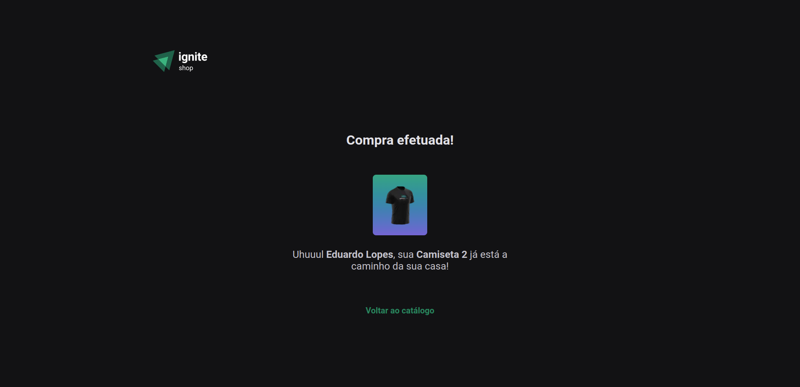

# 05-ignite-shop

## Conceitos Aprendidos

Neste projeto, tive a oportunidade de aprender e aplicar os seguintes conceitos:

- **Fundamentos do Next.js**: compreensão e utilização das funcionalidades principais do framework para construção de aplicações web.
- **Estilização CSS-in-JS**: aplicação de estilos dinâmicos e componetizados utilizando bibliotecas CSS-in-JS.
- **Integração com plataforma de pagamentos (Stripe)**: integração segura e eficiente com a API do Stripe para processar pagamentos online.
- **SSG (Static Site Generation)**: uso de geração estática para otimizar o carregamento e desempenho da aplicação.
- **SSR (Server-Side Rendering)**: renderização no servidor para fornecer conteúdo dinâmico e aumentar a responsividade da aplicação.
- **SEO (Search Engine Optimization)**: técnicas de otimização para garantir que a aplicação seja mais visível nos mecanismos de busca.
- **API Routes do Next.js**: criação de rotas de API para lidar com solicitações HTTP diretamente no Next.js.

## Imagens do Projeto

